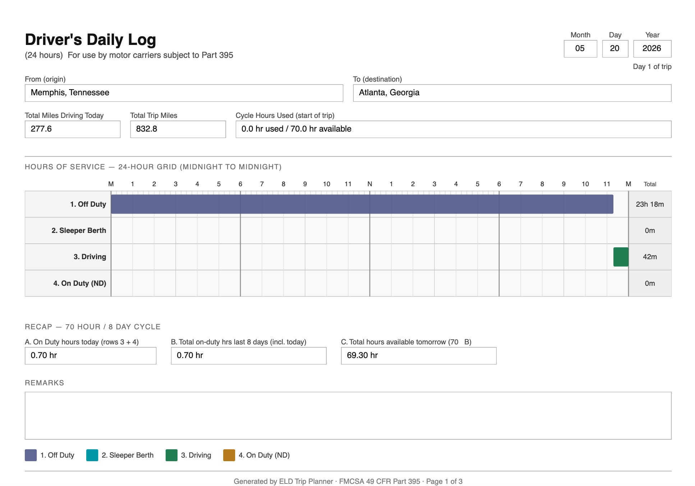

# Spotter Labs — ELD Trip Planner

HOS-compliant trip planning for truck drivers. Enter a current location, pickup, and dropoff get a full route with mandatory rest stops, fuel breaks, and a per-day FMCSA log sheet, all calculated against the 70-hour/8-day cycle.

---

## What it does

- Plans a multi-day truck route that respects FMCSA Hours of Service rules (11-hr driving limit, 14-hr on-duty window, 30-min break after 8hrs, 10-hr off-duty reset)
- Generates a 24-hour grid log sheet for every day of the trip, drawn as SVG
- Shows the route on an interactive map with color-coded stop markers and arrival/departure popups
- Stores trip history so drivers can reload past plans
- Geocodes addresses via Photon (no API key needed), routes via OpenRouteService HGV truck profile

---

This is an example screenshot of FMCSA 24-hour grid per day driver daily log
---
## Stack and why

**React + Vite** for the frontend. No Next.js because there is nothing server-rendered here — it is a pure planning tool, one page, no SEO requirements. Vite gives near-instant hot reload and splits the PDF and map chunks lazily so the initial load stays small.

**Leaflet via React-Leaflet** for the map. Google Maps and Mapbox both require a billing account just to get an API key. Leaflet is open source, uses OpenStreetMap tiles for free, and renders the route polyline and stop markers with the same fidelity. The only tradeoff is that ORS returns coordinates as longitude-latitude and Leaflet expects latitude-longitude — that flip lives in one utility function.

**Tailwind CSS v4 + shadcn/ui** for styling. shadcn gives unstyled but accessible component primitives (buttons, inputs, tabs) that are easy to theme. Tailwind handles everything else with no runtime overhead.

**Django + Django REST Framework** for the backend. The HOS calculator is pure Python with Decimal arithmetic — no float rounding surprises. Django gives a battle-tested ORM, a migration system, and DRF handles serialization and validation cleanly. FastAPI would have worked too but Django fit better for the model-heavy data layer.

**Photon** for geocoding, **OpenRouteService HGV** for routing. Both were chosen after running benchmarks against real US truck addresses. The short version: Photon was the most accurate at the lowest latency with no API key required. ORS is the only free router that has an actual truck profile with height and weight restrictions. Full benchmark data is below.

**Redis** caches geocode results for 24 hours so repeated address lookups do not hit Photon on every keystroke. Route geometry is stored permanently in Postgres — reloading a past trip is instant and does not burn another ORS API call.

---

## Benchmarks for providers

Geocoding and routing are the two external services this app depends on. I did not want to pick providers by reputation — I benchmarked them. Every number below came from running the same queries against each provider 5 times and measuring real latency and coordinate accuracy. Full data and reasoning is in [benchmarks/RESULTS.md](benchmarks/RESULTS.md).

### Geocoding

I tested four providers: Nominatim, Photon, OpenRouteService, and LocationIQ. HERE Maps and TomTom were ruled out before testing — both require a credit card even for the free tier.

**Latency (p50 / p99, milliseconds):**

| Provider | p50 | p99 | Variance |
|----------|-----|-----|----------|
| Nominatim | 76 | 90 | Very low |
| Photon | 688 | 748 | Low (±60ms) |
| ORS | 787 | 965 | Medium |
| LocationIQ | 854 | 1,703 | High — Dallas p99 hit 2.9s |

**Accuracy (distance error from ground truth, km):**

| Query type | Nominatim | Photon | ORS | LocationIQ |
|------------|-----------|--------|-----|-----------|
| City names | 0.05–0.53 | 0.05–0.53 | 1.3–9.5 | 0.05–0.53 |
| Street address (Empire State Building) | 23.94 | **0.006** | 7.39 | 23.99 |
| Zip code (77001, Houston TX) | 3.29 | 3.34 | **573.76** | 3.34 |

Two results decided everything. ORS returned a dam in Latimer County, Oklahoma for a Houston zip code — 573 km off, wrong state. That ruled it out as a geocoder immediately. Photon returned a location 0.006 km from the Empire State Building on a full street address query while every other provider missed by 7–24 km. Drivers type full addresses, not just city names. Photon was the obvious primary.

LocationIQ was dropped because the 2.9s p99 is unacceptable for an autocomplete field, and it is just Nominatim under the hood anyway — same accuracy, worse latency.

Nominatim stays as fallback. At 76ms p50 it is fast enough that if Photon is ever unreachable, the user barely notices.

### Routing

I tested OpenRouteService and OSRM. Valhalla has a truck profile but requires self-hosting. GraphHopper locks truck routing behind a paid plan.

**Latency (p50 / p99, milliseconds):**

| Provider | p50 | p99 | Stdev |
|----------|-----|-----|-------|
| ORS HGV | 1,030 | 1,066 | 63ms |
| OSRM | 1,005 | 1,935 | 349ms |

**Accuracy (% error vs ground truth):**

| Route | ORS HGV | OSRM |
|-------|---------|------|
| Chicago to Indianapolis (182 mi) | 0.45% | 0.71% |
| Dallas to Atlanta (435 mi) | 3.86% | 3.76% |
| Chicago to LA (2,012 mi) | 0.25% | 0.10% |
| NYC to LA (2,790 mi) | 0.12% | 0.30% |

Accuracy is nearly identical between the two on interstate routes — both under 4%. The difference is that ORS has a real truck profile (`driving-hgv`) that respects bridge heights, weight limits, and truck-prohibited roads. OSRM on the public demo is car-only. OSRM also has a p99 standard deviation of 349ms vs ORS at 63ms — the shared demo server has no SLA.

ORS is the primary. OSRM is kept as an emergency fallback with a logged warning, because a slightly imperfect route is better than an error screen when a driver needs to plan a run.

**Total external cost: $0. No credit cards. One free ORS API key. Geocoding needs no keys at all.**

---

- See [backend/README.md](backend/README.md) for Running Backend Locally
- See [frontend/README.md](frontend/README.md) for Running Frontend Locally
- See [benchmarks/README.md](benchmarks/README.md) for Checking and Running Benchmarks
